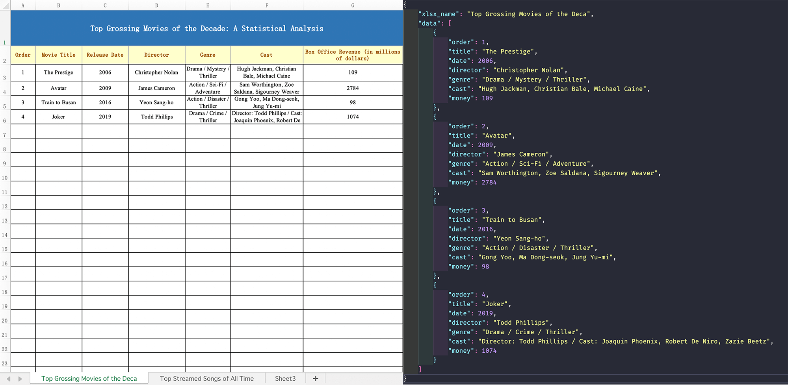

<div align="center">


让可视化的excel表格，更好的管理你的json数据

 


[English](./README.md) | 简体中文

</div>

## Effects


## Introduction
> `ejc-cli`，前三个字母由`excel`、`json`或者`js`、`cli`三个单词首字母组成。

我们项目有时为了省去了后端的开发成本，会把一些数据直接用`json`或者`js`文件存在本地，然后再用这些数据来做渲染。但是当我们的数据多了，维护一个冗长的`json`或者`js`文件可能会很费力，而且这些文件也只能在开发人员中传播。

为了解决这些痛点，用excel来管理我们的数据是非常好的选择。  

excel比起`json`或者`js`文件，可以更加可视化，更加条理的收集并管理我们的数据。所以我们可以用excel来收集我们想要的数据，再通过`ejc-cli`这个工具输出开发人员用到的`json`文件。

**这样有个最大的好处就是，我们不但更方便地管理了数据，并且数据不再局限于在开发人员中传播，非开发人员可以用excel传播**。这也同时大大提高了工作效率，加强了不同人员间的的合作。

## Quick start
### 1. 安装工具
````npm
npm i ejc-cli -g
````
### 2. 获取模板excel文件  
你不需要自己做一个excel表格，这里已经做好了一个模板excel文件，你只需要执行：
````npm
ejc-cli gt
````
或者将模板文件保存到目录：
````npm
ejc-cli gt './xlsx_template/'
````
这样我们就能获取到一个excel模板文件了，然后把里面的数据换成你想要的就好了，对就这么简单。
### 3. 输出`json`文件
> 你可以去 [Explanation](#Explanation) 模块更好的了解`-k`、`-s`
- 使用全局方式设置`-k`、`-s`输出   

    如果你的excel文件中有多个`sheet`，并且它们的结构相似（像`template.xlsx`文件中的两个`sheet`），那么你可以直接设置：
    ````npm
    ejc-cli -i './xlsx_template/template.xlsx' -k 'order, title, date, director, genre, cast, money' -s 3 -n 'movieData, songData'
    ````
    这样的话，`ejc-cli`将会从所有`sheet`的`第3行`开始，读取数据，并且输出的所有`json`数据的`key`值都为`order, title, date, director, genre, cast, money`

- 单独设置`-k`、`-s`输出  

    如果你的excel文件中有多个`sheet`，每个`sheet`要开始读取数据的地方不一定都是`第3行`开始，每个`sheet`的`key`值也不一定一样，那么你可以用”`|`“分割符：
    ````npm
    ejc-cli -i './xlsx_template/template.xlsx' -k 'order, title, date | num, song_title, artist' -s '3 | 4' -n 'movieData, songData'
    ````
    这样的话，`ejc-cli`会从`第3行`开始读取第一个`sheet`的数据，第一个`sheet`的`json`数据key值是`order, title, date`；  
    `ejc-cli`会从`第4行`开始读取第二个`sheet`的数据，第二个`sheet`的`json`数据key值是`num, song_title, artist`


## Notice
在使用过程中，这里有以下注意事项：
- 生成`json`数据时，请确保`-s`的值是否正确。`-s`代表的是，数据从每个`sheet`第几行开始读取，默认是`第3行`
- 当设置`-k`值的个数小于`sheet`的列数时，会以`-k`值的个数做渲染  
  
  你可以试试执行以下命令，看看输出的数据有什么区别
  ````npm
  ejc-cli -i './xlsx_template/template.xlsx' -k 'order, title' -n 'movieData, novelData'
  ````
  这时输出的`json`数据只有`order`，`title`两个值

## Options and commands
````npm
Usage: ejc-cli [options] [command]

=> Manage your json data better with visual excel sheets

Options:
  -v                        View current version
  -i, --input [path]        Path of excel to be converted
  -o, --output [path]       Path to the output json file
  -n, --json-name [string]  Name of the output json file
  -k, --keys [string]       The key value corresponding to each column of each sheet
  -s, --start-row [number]  Read data from what row of sheet
  -h, --help                View help

Commands:
  gt [path]                 Get the excel template file
````

### 选项
| 参数 | 是否必须 | 默认值 | 说明 | 补充
| ---| --- | --- | --- | ---
| `-v` | 否 | |  查看当前版本 |  
| `-i` | 是 | | 要转换的excel表格所在路径 | 
| `-o` | 否 | 当前目录的`xlsx_json`文件夹下 | `json`文件输出路径 |
| `-n` | 否 | 默认`sheet`数量索引命名</br>（`data_1.json, data_2.json,...`） | 输出的`json`文件名字 |
| `-k` | 否 | 默认会以当前每列的索引作为`key`</br>（`[{key_1: ''}, {key_2: ''},...]`） | `excel`表格中每列对应要设置的`key`值名称 | 可以用<code>&#124;</code>来设置每个`sheet`导出的`json`数据的`key`
| `-s` | 否 | `3` | 从excel表格中哪一行开始读取数据  |  可以用<code>&#124;</code>来设置每个`sheet`从第几行开始读取数据
| `-h` | 否 | | 查看帮助  |

### 命令
| 语句 | 参数 | 说明
| ---|  --- |  --- |
| `gt` | `path` | `path`为获取的模板excel文件保存目录。</br>当`path`为空时，获取的模板excel文件默认保存在当前目录的`xlsx_template`文件夹下

## <a id="Explanation">Explanation</a>
我们可以看看获取到的模板excel文件（`template.xlsx`）结构：  


表格的总体结构一般分三块（`top`，`middle`，`bottom`）：
- 第一块，我们称它为（`T`），指整个表格的大标题
- 第二块，我们称它为（`M`），对表格每列信息的概述，也是用来设置对应的`key`值的（`-k 'order, title, date, director, genre, cast, money'`）
- 第三块，我们称它为（`B`），它所在的行数，就是程序要开始读取数据的行数（`-s 3`）

## How to use your own excel sheet
因为每个人的制作的excel都不一样，所以我们强烈建议你使用我们模板excel文件（`template.xlsx`）来管理数据，但是这个文件也许样式不一定能满足你。  

所以如果你想`DIY`表格的样式，根据 [Explanation](#Explanation) 模块的分析，`DIY`你的表格时需要遵循以下规则：
- `T`跟`M`模块是非必须的，**但是，请保证你的excel文件里的数据，与上图的`B`模块结构相同**
- 请确保你的`-s`值是正确的
