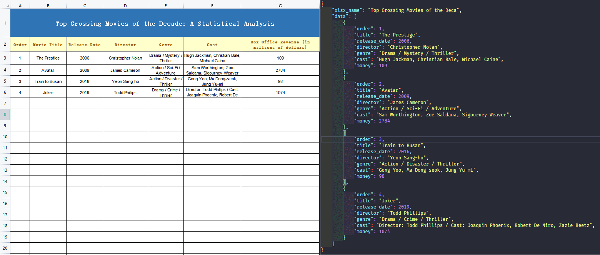

<div align="center">


Manage your `json` data better with visual excel sheets

 


English | [简体中文](./READEME_zh-CN.md)

</div>

## Effects



## Introduction
> `ejc-cli`, the first three letters of which consist of the initials `excel`, `json` or `js`, `cli`.

Our projects sometimes save on back-end development costs by storing some data directly locally in `json` or `js` files and then using that data for rendering. But when we have more data, maintaining a lengthy `json` or `js` file can be laborious, and these files can only be propagated among developers.

To solve these pain points, using excel to manage our data is a great option.  

excel allows for a more visual and organised way of collecting and managing our data than a `json` or `js` file. So we can use excel to collect the data we want, and then use the `ejc-cli` tool to export the `json` files that developers use.

**One of the great benefits of this is that not only is it easier to manage the data, but it is no longer restricted to the developers, as non-developers can use excel to distribute it**. This also makes it much more efficient and enhances collaboration between different people.

## Quick start
### 1. Installation tools
````npm
npm i ejc-cli -g
````
### 2. Get the template excel file
You don't need to make an excel sheet yourself, a template excel file is already made here, you just need to execute:
````npm
ejc-cli gt
````
Or save the template file to the specified directory:
````npm
ejc-cli gt './xlsx_template/'
````
This will give us access to an excel template file, then just replace the data in it with what you want, yes it's that simple.
### 3. Exporting `json` files
> You can go to the [Explanation](#Explanation) module for a better understanding of `-k`, `-s`
- Setting `-k`, `-s` output using the global method   

    If you have more than one `sheet` in your excel file and they have a similar structure (like the two `sheets` in the `template.xlsx` file), then you can simply set:
    ````npm
    ejc-cli -i './xlsx_template/template.xlsx' -k 'order, title, date, director, genre, cast, money' -s 3 -n 'movieData, songData'
    ````
    In this case, `ejc-cli` will read the data from `row 3` of all `sheets` and the `key` values of all the output `json` data will be `order, title, date, director, genre, cast, money`.

- Set `-k`, `-s` output separately 

    If you have more than one `sheet` in your excel file, and each `sheet` does not always start reading data from `line 3`, and each `sheet` does not always have the same `key` value, then you can use the "`|`" splitter:
    ````npm
    ejc-cli -i './xlsx_template/template.xlsx' -k 'order, title, date | num, song_title, artist' -s '3 | 4' -n 'movieData, songData'
    ````
    In this case, `ejc-cli` will read the data of the first `sheet` starting from `line 3`, and the `json` data key value of the first `sheet` will be `order, title, date`.  
    `ejc-cli` will read the data of the second `sheet` starting from `line 4`, and the `json` data key values of the second `sheet` are `num, song_title, artist`


## Notice
Here are the following caveats in use.
- When generating `json` data, make sure that the value of `-s` is correct. `-s` means that the data is read from the first row of each `sheet`, the default is `row 3`.
- When the number of `-k` values is set to less than the number of columns in the `sheet`, it will render with the number of `-k` values  
  
  You can try running the following command to see the difference in the output data
  ````npm
  ejc-cli -i '. /xlsx_template/template.xlsx' -k 'order, title' -n 'movieData, novelData'
  ````
  The output of the `json` data is only `order` and `title` values

## Options and commands
````npm
Usage: ejc-cli [options] [command]

=> Manage your json data better with visual excel sheets

Options:
  -v                        View current version
  -i, --input [path]        Path of excel to be converted
  -o, --output [path]       Path to the output json file
  -n, --json-name [string]  Name of the output json file
  -k, --keys [string]       The key value corresponding to each column of each sheet
  -s, --start-row [number]  Read data from what row of sheet
  -h, --help                View help

Commands:
  gt [path]                 Get the excel template file
````

### Options
| Parameters | Required | Default | Description | Supplementary
| ---| --- | --- | --- | ---
| `-v` | No | | View current version | 
| `-i` | Yes | | Path to the excel sheet to be converted |
| `-o` | No | `xlsx_json` folder in the current directory | `json` file output path |
| `-n` | No | Default `sheet` number index naming</br> (`data_1.json, data_2.json,... `) | Output `json` file name |
| `-k` | No | The default is to use the current index of each column as the `key`.</br>（`[{key_1: ''}, {key_2: ''},...]`） | Each column in the `sheet` corresponds to the name of the `key` value to be set | You can use <code>&#124;</code> to set the `key` of the `json` data exported from each `sheet`
| `-s` | No | `3` | Which row to start reading data from in an excel sheet  |  You can use <code>&#124;</code> to set the row from which each `sheet` is to be read
| `-h` | No | | View Help

### Commands
| Statement | Parameters | Description
| ---|  --- |  --- |
| `gt` | `path` | `path` is the directory where the template excel file is saved.</br>When `path` is empty, the template excel file is saved in the `xlsx_template` folder of the current directory by default

## <a id="Explanation">Explanation</a>
We can look at the structure of the obtained template excel file (`template.xlsx`): 


The overall structure of the table is generally divided into three blocks (`top`, `middle`, `bottom`).
- The first block, which we call (`T`), refers to the broad heading of the entire table
- The second, which we call (`M`), is an overview of the information in each column of the table and is also used to set the corresponding `key` value (`-k 'order, title, date, director, genre, cast, money'`)
- The third block, which we will call (`B`), is the number of rows in which the program will start reading data (`-s 3`)

## How to use your own excel sheet
Because everyone's production of excel is different, we strongly recommend that you use our template excel file (`template.xlsx`) to manage your data, but this file may not always be styled to suit you.  

So if you want to `DIY` the style of your table, according to the analysis of the [Explanation](#Explanation) module, the following rules need to be followed when `DIY`ing your table:
- The `T` and `M` modules are not required, **but please ensure that the data in your excel file, has the same structure as the `B` module in the above diagram**
- Please ensure that your `-s` values are correct
